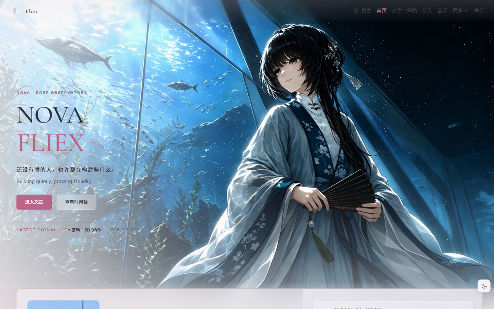

# Marlin-web — 个人网站

一个以「深夜幕蓝 + 玫瑰星系粒子」为视觉核心的个人网站,基于 Marlin(mikejosion.github.io)的静态构建产物重建,采用 Hexo 8.1.2 + Butterfly 5.7.0 + rose-galaxy 定制层。
借鉴 https://mikejosion.github.io/ ，进一步个性化创新、开放共享的产物。

| 深色主题 | 浅色主题 |
| --- | --- |
|  |  |

---

## 目录

- [功能特性](#功能特性)
- [快速开始](#快速开始)
- [加文章](#加文章)
- [加工程](#加工程)
- [各版块逻辑](#各版块逻辑)
- [项目结构](#项目结构)
- [技术栈](#技术栈)
- [定制记录](#定制记录文件级)
- [构建过程记录](#构建过程记录)
- [维护文档](#维护文档)

---

## 功能特性

- 深色 / 浅色双主题:**打开页面只按时间决定**(7:00-17:59 浅色、18:00-6:59 深色),不读任何持久记忆;手动切换仅当前会话(sessionStorage,会话内导航保持,关浏览器即清),粒子与背景全联动换肤
- 玫瑰星系粒子画布:尘埃 / 雾气 / 花瓣三类粒子 + 星座连线 + 鼠标吸引,30fps 节流,`prefers-reduced-motion` 降级
- Hero 打字机副标题、滚动显现动画、LATEST SIGNAL 最新文章卡
- 全站本地搜索(search.xml,无后端)、PJAX 无刷新导航、访问统计(busuanzi)
- 15 篇文章(Markdown 写作工作流 8 + 辞赋 5 + 诗词 2)+ 文章 / 音乐 / 瞬间 / 关于 页面 + 工程板块;导航:首页 / 文章 / 工程 / 音乐 / 瞬间 / 关于
- 文章底部版权卡「文章作者 / 文章链接」按 front matter `author`/`url` 显示(来源标注:`url` 填"无"显示为"无",`author` 可带朝代如 [魏晋]曹植)
- 文章详情路由 `/posts/<标题>/`(与索引/标签的 `articles/` 并列,见[加工程](#加工程)同理);工程页 `/projects/`(列表+5 个详情)
- Hero 背景图:深色主题 `night.webp`、浅色主题 `day.webp`(webp 压缩,质量 95)
- 已移除:鼠标点击粒子迸发、点击浮字、玫瑰绽放花瓣彩蛋、小王子彩蛋、归档/分类/模板/照片/课程板块(见定制记录)

---

## 快速开始

```bash
npm install          # 首次安装依赖
npm run server       # 本地预览 http://localhost:4000
npm run build        # 生成 public/(含文章、标签、搜索索引、feed)
npm run clean        # 清理 public/ 与缓存
npm run deploy       # 部署(需先在 _config.yml 配置 deploy.repo)
```

---

## 加文章

**1. 在 `source/_posts/` 新建 md 文件**,例如 `source/_posts/Markdown 入门指南.md`:

````markdown
---
title: Markdown 入门指南
date: 2026-08-17 00:00:00
tags:
  - Markdown语法
---

# Markdown 入门指南

Markdown 概述、工作原理以及用途。

## Markdown 是什么？

Markdown 是一种轻量级的标记语言……

```go
fmt.Println("代码块示例")
```
````

字段说明:

| 字段 | 必填 | 说明 |
| --- | --- | --- |
| `title` | 是 | 文章标题,显示在页面、卡片、feed |
| date | 是 | 发布日期,决定文章排序(URL 由站点 `permalink: posts/:title/` 决定,不含日期) |
| order | 否 | 首页精选记录排序(小在前);新文章加 order 即可自动上首页,缺省排在最后 |
| `tags` | 否 | 标签列表,决定归属的标签页(见下) |
| `author` | 否 | 底部版权卡"文章作者"显示文本(可带朝代,如 `[魏晋]曹植`;留空显示站点名) |
| `url` | 否 | 底部版权卡"文章链接"指向(来源链接;作者名链接同步跟随;填"无"显示为"无") |

**2. 构建:**

```bash
hexo clean && hexo generate
```

**3. 自动完成:**

- 文章页生成:`/posts/Markdown 入门指南/`
- 文章页出现标签链接 → `/articles/Markdown语法/`
- 标签页自动更新(已存在则计数 +1;新标签自动建页)
- `/articles/` 索引、`search.xml`、`sitemap.xml`、`atom.xml` 同步更新

**4. 首页自动同步:** 首页 LATEST SIGNAL 与"精选记录"卡片由模板按 `order` 自动生成,新文章加 `order` 后 `hexo generate` 即自动上首页,无需手工编辑页面。

---

## 加工程

> 工程板块 = `/projects/` 列表 + 每工程一个详情页(`/projects/<id>/`),由生成器渲染;**维护只需改一处数据文件 + 放图片与下载文件**,零手工页面。

**1. 在 `scripts/projects-data.js` 的 `projects` 数组末尾追加一个对象:**

```js
{
  id: 'my-project',                 // 详情页路由名(唯一,小写+连字符)
  title: '我的项目',
  category: '单片机',                // 显示分类(列表页 meta)
  categoryKey: 'mcu',               // 分组键(mcu/model)
  subtitle: '一句话副标题',
  date: '2026-08-27',               // 发表于(可省略,省略则取构建当天)
  description: '列表卡片简介(两行左右)',
  tags: ['STM32', 'PCB'],
  intro: '详情页介绍正文(支持换行段落,300-500 字为宜)',
  cover: '/img/projects/my-project.webp',
  link: 'https://github.com/...',   // 源工程链接(可无)
  linkLabel: 'GitHub',
  downloads: [                      // 下载文件(可无)
    { name: '固件包.zip', url: '/assets/projects/我的项目/固件包.zip', sizeLabel: '12.4 MB', desc: '说明' }
  ]
}
```

**2. 放两张图(webp,质量 80):**
- 列表封面:`source/img/projects/my-project.webp`(3:2,如 1200×800)
- 详情演示图:`source/img/projects/demo-my-project.webp`(16:9,如 1280×720)

**3. 放下载文件(可选):** `source/assets/projects/我的项目/` 目录,文件名与 `downloads[].url` 一致。

**4. 构建:** `hexo clean && hexo generate` — 自动完成:
- 列表页卡片自动出现(封面/标题/简介/分类日期,三列网格)
- 详情页自动生成(`/projects/my-project/`):hero + 标题 + 演示图 + 介绍 + 工程链接按钮 + 资料下载列表 + 评论区(每页评论独立)
- 右栏"其他工程"列表、概览统计(项目数/分类数/标签数)自动更新
- `search.xml`/`sitemap.xml`/`atom.xml` 不包含工程(工程不进 feed)

---

## 各版块逻辑

### 文章系统(Hexo 渲染)

- 文章源:`source/_posts/*.md`,由 Hexo 渲染为 `/posts/<标题>/`(站点配置 `permalink: posts/:title/`)
- 写作流程见上方[加文章](#加文章)
- 文章页的标签链接由 Hexo 按 `tag_dir`(已配置为 `articles`)自动生成

### 标签系统(自动生成,非静态维护)

**工作原理:**

```
_posts/*.md 的 front matter tags
        ↓ hexo clean && generate
scripts/nova-tags.js 生成器
        ↓
/articles/index.html        标签索引(卡片 + 统计)
/articles/<标签>/index.html 每个标签页(hero/统计/文章卡片/相关标签/阅读顺序/侧边栏)
```

- 模板:各页由 pug 布局渲染(`themes/butterfly/layout/{tags-index,tag}.pug`),数据由生成器传入
- 数据自动派生:

| 数据 | 来源 |
| --- | --- |
| 卡片摘要 | front matter `description`,否则正文首段(去 Markdown 符号,截 90 字) |
| 卡片封面 | 按文章标签推断:Go→tech-go、MySQL/sql 系→tech-mysql、算法/链表/栈系→tech-algorithm、其他→tech-notes |
| 统计 / 相关标签 / 阅读顺序 | 全自动计算 |

**加一个新标签的完整流程**(以给文章加标签 `AI` 为例):

```markdown
---
title: LM Studio 接入 OpenCode 指南
date: 2026-08-17 00:00:00
tags:
  - AI          # ← 加这一行
---
```

然后 `hexo clean && hexo generate`,`/articles/AI/` 自动出现,零手工。

### 搜索 / sitemap / atom(生成器输出)

- 同一生成器输出三个文件(构建时自动):

| 文件 | 内容 | 用途 |
| --- | --- | --- |
| `search.xml` | 全部文章纯文本全文索引 | 站内本地搜索 |
| `sitemap.xml` | 文章 URL + 更新日期 | SEO |
| `atom.xml` | RSS/Atom feed | 订阅 |

- `hexo-generator-feed` 已卸载,由生成器统一输出,避免重复
- 搜索命中逻辑:索引 = 渲染后的纯文本(代码块 `figure.highlight`/`pre` 与内联 `<code>` 已剔除,源码不参与匹配);摘要从**命中位置附近**截取(约 120 字符),对话框内两行截断——命中位置只会落在渲染文字上,摘要永不显示源码

### 首页

- 由 hexo 布局渲染(`themes/butterfly/layout/home.pug` + `scripts/home-generator.js`),**P5 起三大区块全部动态生成,卡片由生成器注入占位(`<!--NOVA-FEATURED-->` / `<!--NOVA-RECENT-->` / `<!--NOVA-LATEST-->`),模板只负责骨架**:
  - **LATEST SIGNAL**(hero 内)= 工程 + 文章中"最近提交"的第 1 名:按 `updated 降序 → 浏览量降序 → 标题` 排序,带 `[工程]`/`[文章]` 标记
  - **精选工程** = 工程按 `浏览量降序 → updated 降序 → 标题` 取前 3(左大卡 lead + 右上/右下 side 卡,封面=各工程图 `/img/projects/*.webp`)
  - **最新文章** = 文章按 `updated 降序 → 浏览量降序 → 标题` 取前 6(2 列 3 行,左封面 + 标题 / 发表于日期 / 标签)
- **浏览量**(排序数据):部署前运行 `node scripts/lib/fetch-views.js`,从 busuanzi API 抓取各页真实 page_pv(带 Referer 查询)→ 写入 `data/views-cache.json`;**手动调整**:编辑该文件 `pv` 段的数字即可(下次抓取自动在其上累加真实增量,不会覆盖;详细说明见同目录 `views-cache.md`)
- **修改日期**:文章自动用 Hexo `updated`(md 无该字段时=文件最后修改时间);工程自动取 `source/assets/projects/<工程名>/` 目录修改时间(更新工程=换文件=日期自动变),也可在 `projects-data.js` 写 `updated:'YYYY-MM-DD'` 覆盖
- 静态骨架存于 `themes/butterfly/layout/home-parts/{top,mid,bottom}.html`,改动请保持占位标记与 DOM 结构

卡片结构示例:

```html
<!-- 精选工程(lead): data-href + post_cover + recent-post-info -->
<div class="nova-note-card nova-note-card--lead" data-href="/projects/drone/" role="link" tabindex="0" aria-label="查看工程：琛光无人机">
  <div class="post_cover"><a href="/projects/drone/" title="琛光无人机">
    </a></div>
  <div class="recent-post-info">
    <a class="article-title" href="/projects/drone/" title="琛光无人机">琛光无人机</a>
    <div class="article-meta-wrap">…发布于/分类…</div>
    <div class="content">简介</div>
  </div>
</div>

<!-- 最新文章(2 列 3 行): 封面贴左 + 标题/发表于/标签 -->
<a class="nova-recent-card" href="/posts/.../" role="link" aria-label="阅读文章：标题">
  <span class="nova-recent-cover"></span>
  <span class="nova-recent-info">
    <span class="nova-recent-title">标题</span>
    <span class="nova-recent-meta"><time datetime="YYYY-MM-DD" title="发表于 YYYY-MM-DD"><i class="far fa-calendar-alt" aria-hidden="true"></i>发表于 YYYY-MM-DD</time><span class="nova-recent-tag"><i class="fas fa-inbox" aria-hidden="true"></i>标签</span></span>
  </span>
</a>
```

- 第一张工程卡用 `nova-note-card--lead`,其余用 `--side`;URL 中空格需编码为 `%20`
- 生活碎片区指向 /music/、/moments/(按钮文案:进入音乐 / 进入说说),与文章无关

### 工程板块(生成器渲染,见[加工程](#加工程))

- `/projects/` 列表 + `/projects/<id>/` 详情,全部由 `projects-generator.js` 生成
- 数据:`scripts/projects-data.js`(工程清单+下载)+ `scripts/projects-intro.js`(详情介绍文案)
- 封面/演示图:`source/img/projects/*.webp`;下载文件:`source/assets/projects/<工程名>/`
- 详情页:hero + post 信息(发表于/更新于/浏览量/评论数)+ 演示图 + 介绍 + 工程链接 + 资料下载 + Waline 评论(每工程 path 独立)
- 列表页:概览统计(项目/分类/标签)+ 三列卡片

### 主题切换

- **只按时间制**:打开页面不读任何持久记忆,7:00-17:59 浅色、18:00-6:59 深色(访客本地时间,定时器精确排到边界原地切换)
- **手动切换**(任意页 `#darkmode` 按钮):仅当前会话——写入 sessionStorage,会话内导航(含 PJAX)保持,关闭浏览器/新标签即清空,重新打开只按时间
- 首帧脚本(各页 `<html>` 后内联 + 文章页 injector)同样只按时间,避免"先深后浅"闪烁
- 实现:`source/rose-galaxy/js/nova-ux.js`(时间主题模块)+ 各页首帧脚本 + `scripts/inject-theme.js`

### 导航栏

- 除首页外全局统一(以音乐页为基准,`custom.css` 中 `body:not(.nova-home-active)` 规则):

| 状态 | 样式 |
| --- | --- |
| 高度 | 68px |
| 未滚动(深浅) | 全透明,透出各页 hero |
| 浅色滚动后 | 保持全透明(light 分支特异性高于滚动条规则) |
| 深色滚动后 | 深色毛玻璃条 rgba(7,10,20,.72) + blur(18px) |
| 菜单文字 / 站点名 / 搜索按钮 | 跟随主题统一 |

- 当前页高亮:进入各页时对应菜单标玫瑰色(深 #ce8299 / 浅 #9a6177),由 `nova-ux.js` 的 `syncMenuActive()` 按路径匹配加 `.active`(桌面 `#nav` + 移动 `#sidebar`),pjax 切页自动更新;文章菜单覆盖 `/articles/`、标签页与文章详情页
- 首页(nova-home-active)悬浮透明导航独立,导航文字浅色未选中近黑 `#1f1d24`、菜单 17px / 站名 18px

### 页面板块

| 路径 | 内容 | 样式文件 |
| --- | --- | --- |
| `/` | 首页 | `rose-galaxy/css/nova-home.css` |
| `/articles/` | 文章标签索引(生成器) | `tag-page.css` |
| `/articles/<标签>/` | 标签页(生成器) | `tag-page.css` |
| `/posts/<标题>/` | 文章详情(Hexo 渲染) | Butterfly 原版 + `custom.css` |
| `/projects/` | 工程列表(生成器) | `projects-page.css` |
| `/projects/<id>/` | 工程详情(生成器) | `project-detail-page.css` |
| `/music/` | 音乐播放 | `music-page.css` |
| `/moments/` | 瞬间说说(中文名"说说") | `moments-page.css` |
| `/about/` | 关于 | `about-page.css` |
| `/404.html` | 404 | Butterfly 默认 |

### 评论系统 (Waline)

- 评论系统:后端 Waline v2 部署于 Vercel(`marlincn-github-io.vercel.app`,仓库 `waline` 分支,3 文件 serverless 模板),数据存 Neon PostgreSQL(免费额度);管理后台 `{serverURL}/ui/`(需注册管理员)
- 配置:`_config.butterfly.yml` → `comments.use: [Waline]` + `waline.serverURL`;文章/普通页评论由主题渲染(`#post-comment` + `#waline-wrap`),开启评论数(count)
- 瞬间/音乐/关于页:body 片段内嵌 Waline 挂载(serverURL 与主题配置一致)
- 瞬间页"评论即说说":`moments-feed.js` 分页拉取 `/moments/` 全部评论,站长评论(三重判定:user_id=1 / 昵称 Marlin / administrator 标记)动态渲染为说说卡片——元数据行(心情:/地点:/人物:/天气:)行级识别为标签、emoji 整块保留、最新条 LATEST;说说流固定展示 3 条、区域内滚动(滚动条隐藏)、月头样式对齐参考站;右侧「最近状态」为本地收藏列表(点心形收录、最新点击置顶、7 条内完整展示超出滚动、服务端已删说说的收藏自动清除,localStorage `nova-moments-mood-v2`);评论区管理员评论**刷新后隐藏**(本次会话内保持可见可管理,如删除;整条含头像隐藏);说说流仅在页面加载/PJAX 时拉取更新(无自动重拉/轮询);旧硬编码瞬间已清除
- 评论按页面 URL(`path`)存储——页面路径变更后旧评论不迁移(如需迁移在数据层操作)

---

## 项目结构

```
Marlin-web/
├── _config.yml              Hexo 站点配置(permalink: posts/:title/ 等)
├── _config.butterfly.yml    Butterfly 主题配置(导航/搜索/注入)
├── package.json             Hexo 8.1.2 + 插件 + hexo-cli
├── scripts/
│   ├── site-config.js       ★ 站点配置单源(Node 侧,SITE 从 _config.yml 读取)
│   ├── parts-common.js      ★ 公共壳组装函数(composeShellTop/buildFooter/composeShell)
│   ├── nova-tags.js         ★ 生成器:标签/索引(layout 渲染)/search/sitemap/atom
│   ├── home-generator.js    首页生成器(body 骨架 + posts → layout)
│   ├── page-generator.js    静态页生成器(music/moments/about/404)
│   ├── projects-generator.js 工程页生成器(列表+详情)
│   ├── projects-data.js     工程数据(清单/封面/下载)
│   ├── projects-intro.js    工程介绍文案
│   ├── inject-theme.js      文章页首帧主题脚本注入(head_begin)
│   ├── lib/date.js          日期工具(fmtDate)
│   └── minify.js            ★ 构建后 JS 压缩(esbuild)
├── py-tools/                 外部工具(hexo 不加载):tools/(转换/验证) + archive/(历史补丁)
├── source/                  网站源文件
│   ├── _posts/              15 篇文章 Markdown(front matter: title/date/tags/order/author/url)
│   ├── img/                 图片(按用途分层:hero/music/brand/misc/covers/projects)
│   ├── rose-galaxy/         ★ nova 定制层(css / js / fonts / animation)
│   ├── assets/projects/     工程下载文件(按工程名分包)
│   ├── css/ js/             Butterfly 基座资源(见维护文档:index.css 勿改)
│   └── robots.txt
├── themes/butterfly/layout/
│   ├── base.pug             ★ 基础布局(html + head partial + body)
│   ├── _partials/           head.pug(统一 head)/helpers.pug(共享函数)
│   ├── parts-common/        ★ 公共组件单源(loading/sidebar/nav/footer/评论/按钮)
│   ├── {home,tag,idx,page,project}-parts/   各页静态骨架片段(纯页级内容)
│   ├── home.pug / tag.pug / tags-index.pug / music.pug / moments.pug / about.pug / projects.pug / project-detail.pug / 404.pug
│   └── includes/            Butterfly 原版布局链(文章详情页使用)
└── README.md                本站文档(本文档)+ AGENT.md(AI维护手册)
```

---

## 技术栈

| 层 | 选型 |
| --- | --- |
| 静态生成 | Hexo 8.1.2(Node.js 24) |
| 主题基座 | Butterfly 5.7.0(布局 / 侧边栏 / 搜索对话框 / pjax) |
| 定制层 | rose-galaxy(nova 体系:首页特效、各页面样式、UX 脚本) |
| 资源 | 字体自托管(woff2);Font Awesome / pjax / busuanzi 走 CDN |
| 部署目标 | GitHub Pages(根路径) |

---

## 历史记录

> 最新在上;完整历史见下方构建过程记录。

| 日期 | 改动 | 涉及文件 |
| --- | --- | --- |
| 2026-09-04 | **说说页(moments)重做 + 细节定稿**：①**评论即说说重建**:管理员 Waline 评论动态渲染为说说卡——元数据行(心情:/地点:/人物:/天气:)行级识别为标签、emoji 整块保留、最新条 LATEST;说说流固定展示 3 条、区域内滚动(滚动条隐藏)、月头(年 玫瑰小字 / 月 宋体大字 / 条数 灰色右对齐)对齐参考站 mikejosion/shuoshuo;②**最近状态收藏列表**:点心形收录说说(按点击顺序、最新置顶),7 条内完整展示、超出滚动(滚动条隐藏);服务端已删除的说其收藏自动清除(prune 对账);③**评论区管理员评论刷新后隐藏**(会话内保持可见可管理,如删除;整条含头像隐藏);④CURRENT MOOD 眉标样式对齐关于页 LEARNING NOW;⑤**代码质量**:死代码清理(约 25 条规则,含 nav-header 误删后恢复并注明来源)、评论分页取全、文本行转义、isOwner 三重判据、调试导出注释;⑥版本号 p37→p44(本次已随上线发布, 线上同步 p44) | `source/rose-galaxy/{js/{moments-feed,moments-page}.js,css/moments-page.css}`、`themes/butterfly/layout/page-parts/moments.html`、`scripts/page-generator.js`、`_config*.yml`、`README.md`、`AGENT.md` |
| 2026-09-03 | **图片整改 + 优化项收尾**：①logo1.jpg → headpicture.jpg(sidebar 头像/avatar 配置/og·twitter 分享图 5 处引用)并删 logo1;②玫瑰 Logo 更名 magic-cube-logo.png(导航/主题配置/音乐页 3 处);③文章大图 webp 化(夏末游鳞 4.1MB→215KB / 暗香胜雪 3.0MB→184KB, q85, md 引用更新);④README 预览图更新为当前首页截图(docs/, `?theme=dark|light` URL 参数强制主题);⑤**冗余收敛完成**: 工程更新日期单源(`lib/project-date.js`)、玫瑰/字体令牌(`--nova-rose*`/`--font-*`)、导航预取/音乐视觉图 DOM 收集、head 停发 extraCss、评论内核组件化、播放器死代码清理、PJAX 主题版方案实测弃用(footer 自定义保留+注释);⑥版本号 p19→p36;⑦**页级 CSS 全量全局化**(butterfly.yml inject.head 单一来源, 移除 head extraCss/body PAGE_STYLES 双份机制与 8 处 pug 死值, 直入/PJAX 零异步窗口), 版本 p36→p37;⑧**文档体系 agent 化**:`MAINTENANCE.md` 更名 `AGENT.md`(AI 维护手册, 含零容忍守则), `DEPLOY.md` 并入后删除 | `source/img/brand/*`、`themes/butterfly/layout/{parts-common/*,_partials/head.pug,page-parts/*,*.pug}`、`source/rose-galaxy/{css/*,js/*,js/lib/*}`、`scripts/{*,lib/*}`、`source/_posts/绘世-Stable Diffusion.md`、`source/images/posts/*`、`docs/`(新)、`_config*.yml`、`README.md`、`MAINTENANCE.md` |
| 2026-09-02 | ① **全站无缝 + 音乐悬浮窗**：①**PJAX 全站化**——页级 CSS 迁入 `#body-wrap`(随 PJAX 内容切换, 首页特效脚本原有 destroy/init 防护), 站内任意切页播放不中断;②**音乐页悬浮窗开关**(滑动式, 会话级默认关, 迷你条 ×=关闭开关, 拖动仅右下手柄);③**播放器链路**: 云函数适配(SCF 网关以 base64 文本传输音频→fetch 解码, audio 直连因网关注入 json 头不可行已弃用)、回音乐页同曲不重拉流;④工程页补 `projects-page.css`(修 PJAX 下列表失真);⑤清理播放器死代码;⑥版本号 bump p19→p28 | `scripts/{parts-common,site-config,page-generator,projects-generator,home-generator,nova-tags}.js`、`themes/butterfly/layout/{home-parts/*,page-parts/{music,about}.html,parts-common/footer.html,_partials/head.pug,*.pug}`、`source/rose-galaxy/{css/{nova-home,music-page,nova-player,tag-page,about-page,custom}.css,js/{nova-player,music-page,nova-ux}.js}` |
| | ② **首页定稿 + 搜索升级(音乐直达)**：①首页三段式说明段定稿(回退初始字体/间距与关于页一致 12px, 仅生活碎片保留第三段 14px), footer 简化(删 GitHub/Email/Music/Moments 导航, "Built in 2026."), 碎片卡片字号/位置微调; 关于页三段间距收紧 + 文案改"知识的愉悦…"/"欢迎在这里留下一句话。";②**搜索弹窗**:删"搜索文章"标签、图标锚定输入框中心、快速入口改 文章/工程/音乐、标题黑体、统计"共有 N 个结果";③**音乐纳入搜索**:每首歌独立条目(歌名/作者/简介, 点击 `?song=` 直达定位播放), 歌单构建期自动抓取(`scripts/lib/music-playlist.js`, 失败用 `data/music-playlist.json` 缓存兜底, 加减歌曲零手工);④**修复**:搜索点击音乐页裸样式——PJAX 排除规则改前缀匹配(`href^=/music/` 等子页不再误入 PJAX);⑤版本号 bump p1→p19 | `themes/butterfly/layout/{home-parts/*,parts-common/footer.html,page-parts/about.html,_partials/head.pug}`、`source/rose-galaxy/{css/nova-home,custom,about-page}.css`、`source/rose-galaxy/js/{music-page,nova-ux}.js`、`scripts/{nova-tags,site-config}.js`、`scripts/lib/music-playlist.js`(新)、`data/{music-playlist.json,refresh-music-playlist.js}`(新) |
| | ③ **概览统计条改版 + 工程更新记录机制 + 版本号单源化**：①文章索引/工程页概览统计条四栏改版(文章:主题总数/文章总数/最多文章主题/最新文章;工程:项目总数/技术标签/热门工程(阅读量数字)/最近更新(年月日),长标题省略号);②**工程更新日期自动记录(=工程目录内最新文件的 mtime,robocopy 保留源文件时间故同步不污染;回退 date 年份)**——工程页与首页 LATEST SIGNAL 统一读取,更新工程零人工(上传文件即自动);③**版本号单源化**:`_config.yml version` → `site-config.VERSION`,pug/生成器引用常量,yml 与 html 片段保留字面 | `scripts/{nova-tags,projects-generator,home-generator,site-config,page-generator}.js`、`themes/butterfly/layout/{tags-index,projects}.pug`、`_config.yml`、`source/assets/projects/`、`README.md`、`MAINTENANCE.md` |
| 2026-09-01 | **页面题记体系 + 分享/搜索描述职责分离**：①各页面 hero 题记统一(文章索引/标签页/工程页/说说页/音乐页, 句号保留);②**og:description 保持功能信息版, 不随题记变**(如工程页"单片机与建模的动手实录…",分享卡片由平台抓取,站内编辑推荐信息版);③说说页/关于页样式定稿(眉标同色、标题字号、hero 尺寸与底部过渡、头像区布局、联系卡顺序等);④资源版本号 bump v=20260831-p1 破除缓存 | `themes/butterfly/layout/*`、`source/rose-galaxy/css/{moments,about,tag}-page.css`、`scripts/projects-generator.js`、`_config.butterfly.yml`、`README.md` |
| 2026-08-31 | **赋文/诗词入库 + 版权信息字段化**：①新增 5 篇辞赋(洛神赋/雪赋/哀江南赋/别赋/离骚)与 2 首诗词(月下小令/西江月·春色三分过二) —— 赋文原文统一楷体 20px(容器内联样式,非 `<style>` 标签)、译文补全为全文译文(古诗文网/诗词汇/古文之家,纯段落无特殊格式)、译文整体折叠(`<details>`,赋文);②**文章底部"文章作者/文章链接"改为按 front matter 显示**:新增 `author`/`url` 两个字段,由新脚本 `scripts/copyright-fields.js` 映射到主题版权卡(`copyright_author/copyright_url`,作者名字链接跟随 `url`,`url` 填"无"显示为"无"),赋文作者填原作者+朝代([魏晋]曹植等)并链到古诗文网原文篇章,MD 教程链到 Markdown Guide 官方,西江月作者林宋链抖音;③标签"古诗词"改"诗词";④**修复**:`<style>` 标签 CSS 文本进入搜索索引/文章描述/上一篇预览(改内联样式 + `nova-tags.js` 生成 search.xml 时剔除 `<style>`)、正文 HTML 块内空行导致闭合标签文本化(块内禁空行)、4 篇 Markdown 系列 front matter 结尾 `---` 与正文粘连(致 YAML 吞正文)、绘世 2 张图片改站内 `/images/posts/`(另 2 张缺源待补) | `source/_posts/*.md`、`scripts/copyright-fields.js`(新)、`scripts/nova-tags.js`、`source/images/posts/`(新)、`README.md` |
| 2026-08-28 | **P5 收尾修复与文档**：①**导航栏修复**:marlin 字样(顶部透明/滚动固定)两态位置一致——删首页 `nav-site-title` flex 专属规则(与主题 nav-fixed a:first-child/last-child 规则冲突)+ 全站滚动态 nav 贴顶修复(本站从不加 `.fixed` class,致 nav 停在 y=6~8;`#page-header.nav-fixed.nav-visible #nav{top:0!important;transform:none!important}`,隐藏态不受影响);②**音乐悬浮窗记忆改会话级**:`novaPlayerState`/`novaMiniPos` 由 localStorage 改 sessionStorage(刷新/站内跳转保留,关闭标签页后不再恢复);④**浅色粒子层(花瓣)移除**:首页浅/深色统一应用深色粒子动画——`galaxy-canvas.js` 删除浅色花瓣全部死代码(4 个 LIGHT_ 常量、`isLightTheme()` 函数与 30+ 处浅色分支/字段: 花瓣生成/渐变绘制/圆润瓣细长瓣/中线高光/浅色连线条数/灯光比例等),深色动画行为不变;③README 首页小节 P5 化 + 历史补本条目 + 删「后续计划」板块;MAINTENANCE 标题改「维护文档」+ 补 P5 数据流小节 | `source/rose-galaxy/css/nova-home.css`、`source/css/custom.css`、`source/rose-galaxy/js/nova-player.js`、`README.md`、`MAINTENANCE.md` |
| 2026-08-27 | ① **P5 首页改版**：①首页"精选记录"→**精选工程**(工程按浏览量取 3:左大卡+右上/右下,封面=工程图);新增**最新文章**区块(按修改日期取 6,2 列 3 行);LATEST SIGNAL 扩为"工程+文章最近提交"第 1 名(带[工程]/[文章]标记);②**浏览量系统**:新增 `scripts/lib/fetch-views.js`(busuanzi API 带 Referer 抓各页真实 page_pv)+ `data/views-cache.json`(显示值=真实值+人工偏移,手动改 `pv` 段后脚本在其上累加不覆盖,说明文档 `views-cache.md`);排序 tie-break 链(updated→浏览量→标题)保证批量更新/同值稳定;工程"最后提交日"=资产目录 mtime(可 `updated:` 覆盖);③样式:最新文章卡(封面贴左、卡高 88、gap 18)、圆角统一 13px、浅色蒙版(封面 96%/文字垫底 82→72)、标签浅玫瑰(#c97993/#a66f82)、"漫游的思想"文案、decorative-loader 路径修复(全站 404) | `scripts/{home-generator,projects-data}.js`、`scripts/lib/fetch-views.js`(新)、`scripts/{views-cache.json,views-cache.md}`(新)、`layout/home.pug`、`layout/home-parts/{top,mid,bottom}.html`、`layout/parts-common/footer.html`、`source/rose-galaxy/css/nova-home.css` |
| | ② **P4 收尾与文档**：README 系统更新(本文档,重建"加一个工程"教程)+ 新增 MAINTENANCE.md(技术维护文档);M1 index.css 头部"上游勿改"标注;M2 custom.css 文件头总目录;C5 Node 配置单源(`scripts/site-config.js` 从 `_config.yml` 读 SITE,不依赖 hexo 作用域);C7 py-tools 拆 `tools/`(构建验证)+`archive/`(历史补丁);R6 #page-header 层叠以标注维护;N3 night-visitor→nova-visitor;N5 nova-404→404 | `README.md`、`MAINTENANCE.md`、`source/css/{index,custom}.css`、`scripts/site-config.js`、`scripts/{nova-tags,projects-generator}.js`、`source/rose-galaxy/{js,css}/nova-visitor.*`、`layout/404.pug`、`py-tools/` |
| | ③ **P3 命名**:shuoshuo→moments 全量(URL `/moments/`、文件/类名/变量 `nova-moments-*`、`nova-moments-route`);中文"说说"保留 | 全站(5 文件重命名 + 33 文本替换) |
| | ④ **P2 分类与路由治理**：img 分层(hero/music/brand/misc + 保留 covers/projects);动画脚本迁 `rose-galaxy/animation/`;空目录清理;版本号统一 `?v=20260827-p2`;assets 扁平化(`assets/projects/<工程名>/`,去 files/mcu|model 双层);permalink → `posts/:title/`(文章详情与 articles/ 并列);预览图入 img/misc |
| | ⑤ **P1 去重 + 首页修复**：公共壳(`parts-common/`)单源 + idx/tag/home/project 壳集成 + R5/R7 常量工具去重(js/lib/site-config.js + utils.js + scripts/lib/date.js)+ 脚本目录规范(legacy 迁 py-tools)+ footer 横幅全局两态收敛 + 工程页 tag-page.css 修复 + 404/music web_bg 补回 + **LATEST SIGNAL/闭合链双份修复**(hero 段提取静态 LATEST + mid 重复闭合链 → 生成器动态注入单份) | 见 `data/P1-REFACTOR.md`(本地) |
| | ⑥ 工程二级页全量打磨 + 首帧/PJAX 修复 + 配图更新:①**首帧/时序修复(fix-v5→v6)**:详情页 CSS 不再只依赖额外注入,`_config.butterfly.yml` 全局 inject.head 挂载 `project-detail-page.css?v=20260901-fix-v6`(所有页面常驻),模板 headOpts.extraCss 保留同名 `<link data-nova-project-detail-style>` 双通道;`nova-ux.js` 路由类(RouteClass)与 routeMarkers 增加 `.nova-project-detail` → `nova-project-detail-route`,修复 PJAX 从 /projects/ 进详情页时 body class 未更新导致的「首帧盒子/侧栏/按钮边框不显示」;②**发型/视觉细调**:详情面板 padding 40px 44px、圆角 20px、背景 #18212d 深色卡、阴影加深;按下标题行补 `发表于/更新于`(与文章页一致)+ 浏览量 + 评论数(每页 waline path 独立);删去文本内引用块;③**meta 日期兜底**:无 date 的工程(drone/kurtips)由生成器填当前日期(`date: p.date \|\| TODAY`),`updated` 统一 TODAY;④**hero 换图**:详情页 hero 换 file_00000000947081fdba8662a2e937ac06.png(转 webp 208KB,1672×941);文章页 `default_top_img` 换 `post-hero-banner.webp`(新增,233KB);音乐页背景换 fliex-source MikeJosion `music_back.webp`(96KB,1672×941);⑤**footer 重复横幅 bug 修复(A 方案)**:根因各页 footer 内联 `background-image` 与 tag-page/music-page 的 `background` 简写把 size/repeat 重置,致 guidang.webp 平铺出上下两层;改为全局方案——`custom.css` 统一 `#footer` 规则(`cover no-repeat` + 深色渐变),删除 idx/tag/music/404 各 parts 内联 background-image,去掉 project-detail-page/projects-page 里重复的页级 footer 覆盖,首页维持自有 nova-footer | `_config.butterfly.yml`、`scripts/projects-generator.js`、`scripts/projects-intro.js`、`themes/butterfly/layout/project-detail.pug`、`themes/butterfly/layout/{idx-parts,tag-parts}/bottom.html`、`themes/butterfly/layout/page-parts/{404,music}.html`、`source/rose-galaxy/css/{project-detail-page,projects-page,tag-page}.css`、`source/css/custom.css`、`source/rose-galaxy/js/nova-ux.js`、`source/img/{projects-detail-hero,music_back,post-hero-banner}.webp` |
| 2026-08-26 | ① 工程二级页(详情页)/projects/\<id\>/ 5 页上线:布局参照 KurTips 课程页——顶部 hero(复用 projects-detail-hero.webp,与一级页同图、文章三级页式 post-bg 顶图) + `#post-info` 标题文字(格式位置与文章三级页一致) + 左主区等大演示图(16:9,源图转 webp q80) + 工程介绍(A 风格 300-450 字:硬件清单/功能亮点/引原文,数据固化 scripts/projects-intro.js 自包含无外部依赖) + 「源工程地址」方形按钮(GitHub/嘉立创,无外链占位"地址整理中") + 右栏"其他工程"列表;一级页卡片整卡改为站内跳转详情页;左右栏比例对齐 KurTips 实测(左主区 ≈ 视口 44.5%,容器 min(1120px));**首帧防"图片铺满"**(修复:布局/图片尺寸全部 HTML 内联占位——grid 两栏/三列、16:9/3:2 padding 占位、img absolute+object-fit,不依赖外部 CSS 时序,首次进入与刷新一致;CSS 只留视觉规则,版本 ?v=20260901-fix-v5);内容源:解压目录/文档 + 原 GitHub README + 嘉立创页面(实抓) | `scripts/projects-generator.js`、`scripts/projects-intro.js`(新增)、`layout/projects.pug`、`layout/project-detail.pug`(新增)、`source/rose-galaxy/css/projects-page.css`、`source/rose-galaxy/css/project-detail-page.css`(新增)、`source/img/projects-detail-hero.webp`、`source/img/projects/demo-*.webp`(5 张) |
| | ② 新增"工程"板块(/projects/):5 个工程(单片机 3 + 建模 2);hero 背景用自定义图(转 webp q80,`/img/projects-hero.webp`);概览条(项目/分类/标签/WIP 自动统计);卡片排版参考 KurTips 课程列表(封面大图 3:2 + 标题 + 简介 + 日期/分类页脚,整卡外链 GitHub/嘉立创/下载,平铺 3 列网格),内容包一级页面板框(1300px);数据快照自 deymo-site portfolio info.json(描述原文)+ manifest(下载清单),维护只需改 `scripts/projects-data.js` 与放封面 webp;全站导航加"工程"(config menu + 8 个 *-parts 硬编码菜单 ×2 处 + pjax 排除 8 处 + nova-ux 路由类/routeMarkers);二级页(详情页)曾试做两版后按需求删除,卡片行为定为外链 | `scripts/projects-data.js`、`scripts/projects-generator.js`、`layout/projects.pug`、`layout/project-parts/top.html`、`source/rose-galaxy/css/projects-page.css`、`source/img/projects/`、`source/img/projects-hero.webp`、`_config.butterfly.yml`、`layout/{idx,tag,home}-parts/{top,bottom}.html`、`layout/page-parts/{music,shuoshuo,about,courses,404}.html`、`source/rose-galaxy/js/nova-ux.js` |
| 2026-08-23 | ① 页面 hero 背景图更换(webp):音乐页背景换为 IMG_20260825_121749(转 webp);文章一级页 hero 换 fenlei.webp、二级页 hero 换 leetcode.webp(原 tech-mysql);文章三级页(default_top_img)背景换 fenlei.webp(与一级页统一);fliex 素材图源。统一 cover 展示、舍弃工程页试验代码 | `source/img/`、`_config.butterfly.yml`、`themes/butterfly/layout/idx-parts/top.html`、`tag-parts/top.html` |
| | ② 首页 loading 改为"仅从网站首次进入时弹一次":此前首屏 loading 在站内 PJAX 返回首页/整页刷新时会重复弹出;引入会话级标志 `sessionStorage.__novaLoadingShown`,由 `nova-ux.js` 统一负责读/写判定,`top.html` 内联脚本只读该标志并据此决定是否显示,消除两处判定冲突。首次进入弹一次,返回首页/刷新不弹 | `themes/butterfly/layout/home-parts/top.html`、`source/rose-galaxy/js/nova-ux.js` |
| | ③ 首页 loading 强化 + 动画优化:①首屏 loading 改为立即显示(去顶部 1200ms 延迟,避免被 DOMContentLoaded 提前取消致一闪而过);②新增最小展示时长 `INITIAL_MIN_SHOW=400`(退场须同时满足背景图 ready 且展示≥400ms);③loading 退场改整体渐隐淡出(480ms)+ MARLIN 内容先 260ms 淡出;④首页空闲时用 `<link rel="prefetch" as="document">` 预取导航其他页(`/articles/`、`/music/`、`/shuoshuo/`、`/about/`,不预取子页),跳转更快 | `themes/butterfly/layout/home-parts/top.html`、`source/rose-galaxy/js/nova-ux.js`、`source/css/custom.css` |
| | ④ 阅读模式配色改成 marlin-minted 陶土橙系:右侧书籍按钮开启的 `body.read-mode` 下的文章正文(`#article-container`)由玫红改陶土橙(浅色米白 #faf8f4 + #d97757 / 深色蓝黑 #171c2e + #e59b7d);`.read-mode` 补覆盖 `--post-*` 变量使正文真正生效;普通文章页/首页等非阅读模式保持玫红不变。配套 Typora 主题 `marlin-minted-light/dark.css`(编辑器用) | `themes/butterfly/_config.yml`、`source/css/index.css`、`source/css/custom.css`、`nova-ux.js` |
| | ⑤ 首页加载顺序修复(方案 A):首屏 loading 图案(`MARLIN / LOADING THE NIGHT...`)等 hero 背景图(`night.webp`/`day.webp`)真正加载完成后再淡出,消除"粒子先动、图片后到"的错位;新增 `HOME_BG` `whenHomeBgReady` 守卫 + 3s 兜底,非首页不受影响 | `source/rose-galaxy/js/nova-ux.js` |
| | ⑥ 部署目标修正:`gh-pages` → `public`(线上 GitHub Pages 实际使用 public 分支;原配置指向不存在的 gh-pages,导致 hexo deploy 推错方向) | `_config.yml`、`.deploy_git` |
| | ⑦ 文章页精选 & 阅读体验:①关相关推荐(related_post.enable=false);②版权卡片仅保留「文章作者/文章链接」两行,删「版权声明」行(post-copyright__notice);③上一篇/下一篇内容介绍由两行改三行(line-clamp 2→3,超出第三行末尾省略号);④文章相关页(详情页 `#body-wrap.post` + 列表/分类页 `#content-inner.nova-tag-content`)右侧垂直滚动条参考 DSH 加宽(8px、圆角、浅玫瑰 `rgba(190,112,138,.45)` → 悬停深玫瑰 `rgba(164,90,120,.92)`),首页/音乐/说说/课程/关于等版块不变 | `themes/butterfly/_config.yml`、`layout/includes/post/post-copyright.pug`、`source/css/index.css`、`source/css/custom.css` |
| 2026-08-22 | P2.7 评论系统:Waline v2 自建后端(Vercel serverless + Neon PostgreSQL,仓库 waline 分支 → marlincn-github-io.vercel.app);启用主题评论(文章/普通页,评论数);说说/音乐/关于页接入;说说页改"评论即说说"(留言评论动态渲染为说说条目,按月分组/LATEST/本地点赞,清除旧硬编码说说);移除 SECURE_DOMAINS(与相对路径评论冲突) | `_config.butterfly.yml`、`layout/page-parts/{about,shuoshuo,music}.html` |
| 2026-08-21 | ① 浅色模式花瓣飘落:删尘埃粒子改花瓣(渐变/3形状/3档色/自转/高光/间歇风/下落缓急,尺寸6-10/40-60片,进入即满屏、重置60%顶部下落);深色模式保持;精选记录布局(板块距大图30px、文字区顶46px底14px、摘要上边距4px、标题与图片距增大);运动自然化(风速-0.02~-0.008/自转±0.0009/摇摆±0.6/下落3.4) | `rose-galaxy/js/galaxy-canvas.js`、`rose-galaxy/css/nova-home.css`、`layout/home-parts/bottom.html`、`layout/home.pug` |
| | ② 首页粒子迭代:深色适度增强(95-115 玫瑰系+星座连线);浅色重设计——左半屏+右上小区域尘埃,修复根因(粒子创建时按主题定参数,切浅色后不重建导致不可见;主题切换现自动重建)与崩溃(连线 dx/dy/b 未定义);浅色最终为 8105 尘埃样式(浅蓝、30% 星带十字芒、85-110 个、白色连线) | `rose-galaxy/js/galaxy-canvas.js`、`rose-galaxy/css/nova-home.css`、`layout/home-parts/bottom.html`、`layout/home.pug` |
| | ③ P2.6 构建压缩:esbuild 压缩全部 JS(188KB→99KB);CSS 保留未压缩(避免颜色舍入差异,gzip 已兜底);build 链接入 minify | `package.json`、`scripts/minify.js`(esbuild) |
| | ④ P2.5 URL 编码规范:sitemap loc、标签页 og:url/canonical/LDJSON、相关标签、索引卡片链接全部 encodeURI;补首页/标签页 canonical | `scripts/nova-tags.js`、`layout/tag.pug`、`layout/tags-index.pug`、`layout/home.pug` |
| | ⑤ P2.2 布局化重构:head 收敛为 `_partials/head.pug`(参数化,9 份→1 份);标签/索引页迁 pug 布局;5 个静态页改布局渲染;删除 nova-templates 占位符模板;域名从 config 读取;版本号全站统一 5.7.0 | `layout/base.pug`、`_partials/`、`layout/*.pug`、`*-parts/`、`scripts/*-generator.js`、`source/`(静态页删) |
| | ⑥ 首页 build 化(P2.1):删除手工静态首页,改由 hexo 布局渲染;LATEST/精选卡片按文章 order 自动输出;摘要统一 70 字 | `layout/home.pug`、`home-parts/`、`scripts/home-generator.js`、`source/index.html`(删)、`_posts/`(加 order) |
| | ⑦ P1 内容清理:删红石科技空文章+首页坏 HTML 卡片;变声器删失效本地图引用;绘世卡片摘要修正;站点描述与实际内容一致;删 7MB 冗余资源 15 项 | `_posts/`、`source/index.html`、`source/img/`、`source/bili-music/`(删) |
| | ⑧ P0 域名修复:全站 deymocn.github.io → marlincn.github.io(72 处/13 文件,含生成器/模板/og/canonical/sitemap/atom/robots) | 全站源码 |
| 2026-08-19 | ① 导航当前页高亮:进入各页面时对应菜单标玫瑰色(深 #ce8299 / 浅 #9a6177,与首页"首页"同款),覆盖未滚动/滚动后/hover;JS 按路径匹配(文章含索引页/标签页/详情页),桌面与移动端同步,pjax 自动更新 | `nova-ux.js`、`custom.css` |
| | ② 首页导航文字:浅色未选中菜单改近黑 #1f1d24(含滚动后),移除 text-shadow;菜单 14/15px→17px、站名 16px→18px(深浅一致) | `nova-home.css` |
| | ③ 首页生活碎片板块文案:进入播放空间→进入音乐、进入日常记录→进入说说 | `index.html` |
| | ④ 关于页浅色导航透明修复:删除静态不透明浅色背景 rgba(247,244,246,.82)+blur,导航透明(与其他页一致,滚动后毛玻璃由全局规则处理);hero 顶部遮罩改深色(音乐页同款)、hero 文字改白 | `about-page.css` |
| | ⑤ 主题逻辑改为"打开只按时间,手动切换仅当前会话":首帧脚本只按时间制(不读 localStorage),手动切换写入 sessionStorage(会话内全局、关浏览器即清),时间边界自动拉回 | `nova-ux.js`、各页首帧脚本、`inject-theme.js` |
| | ⑥ 文章详情页侧边栏"最新文章"→"其他文章":展示同标签(同二级页)下的其他文章,无则显示"无";修复 hexo partial cache 导致模板不生效(改用 include) | `card_recent_post.pug`、`widget/index.pug` |
| | ⑦ 标签页(文章二级页)卡片修复:摘要剥离 HTML 标签(Hexo excerpt 是渲染 HTML,残留未闭合标签破坏 DOM 致箭头交互失效)+ 实体解码;摘要单行 + 下移 10px;卡片 meta 标签去重并换位(标签在前日期在后);箭头交互改 gap 动画(与 fliex 全局一致) | `nova-tags.js`、`tag-page.css` |
| | ⑧ 标签页侧边栏:深色透明 / 浅色白底 + 边框;隐藏滚动条 + overscroll-behavior 悬停翻页;"阅读路径""相关标签"补标题 header | `tag-page.css`、`nova-tags.js` |
| | ⑨ 文章详情页侧边栏 sticky 修复:`#aside-content` 加 align-self:stretch 提供 sticky 活动空间,1101px/820px 以上粘住、以下跟随;宽屏限高 + 隐藏滚动条翻页 | `custom.css` |
| | ⑩ 文章详情页删除简介(card_author)与公告(card_announcement)卡;部署修复:gh-pages 曾被误推整个工程源码,恢复为纯站点产物 | `widget/index.pug`、`_config.butterfly.yml` |
| 2026-08-18 | ① 关于页重构:删"记录内容/关于本站/状态三卡",联系方式三框(GITHUB 链接 / QQ EMAIL mailto / EMAIL mailto),头像换 headpicture.jpg,简介文案更新;修复三框间距(删残留 `.nova-about-contact > div` 规则) | `about/index.html`、`about-page.css`、`img/headpicture.jpg` |
| | ② 音乐页换源:B 站收藏夹"music"(UID 3546712446601247,公开)经腾讯云函数读取,播放器改原生 Audio + stream2 拉流;移除 Meting/网易云/APlayer 依赖 | `music-page.js`、`music/index.html` |
| 2026-08-17 | ① 浅色模式导航栏静止(未滚动)文字改为深色模式同款白色(菜单/站点名 rgba(255,255,255,.7)、搜索 #f2edf0),滚动后浅色毛玻璃不受影响 | `custom.css` |
| | ② 文章页统一背景图:`default_top_img = /img/leetcode.webp`(marlin 参考站 go语法总结 同款,同位置:header 400px / center-cover / 暗色遮罩),9 篇全部生效 | `_config.butterfly.yml` |
| | ③ 搜索索引剔除代码:代码块(`figure.highlight`/`pre`)与内联 `<code>` 不参与匹配,摘要只显示渲染文字;绘世提示词示例改为代码块展示 | `nova-tags.js`、`_posts/绘世-Stable Diffusion.md` |
| | ④ 搜索摘要改为从正文开头截取(非命中位置),只显示渲染文字,无源码;删除正文 `[TOC]` 字面量;摘要两行截断 | `local-search.js`、`custom.css`、`_posts/` |
| | ⑤ 内容换源:marlin 文章全部删除,替换为 `research/MD` 9 篇(标签:Markdown语法×5/AI/AI绘画/工具/杂记);首页 LATEST 与精选记录改为新文章 | `_posts/`、`index.html` |
| | ⑥ 标签系统自动化:新增 hexo 生成器 + 模板,替代手工静态标签页;同时输出 search/sitemap/atom;卸载 hexo-generator-feed | `scripts/nova-tags.js`、`nova-templates/`、`package.json` |
| | ⑦ 删除首页 footer 返回顶部箭头,伪元素占位恢复三列布局 | `index.html`、`nova-home.css` |
| | ⑧ 主题切换 2.B:任意页手动切换 + localStorage 偏好保持,边界拉回 | `nova-ux.js` |
| | ⑨ 导航栏全局模板(方案 C):除首页外统一,双主题透明 + 深色滚动毛玻璃 | `custom.css` |
| | ⑩ 修复 /articles/ 17 页布局 bug(nav 多余 `</div>` 致 body-wrap 提前闭合) | `source/articles/` |
| | ⑪ `/tags/` → `/articles/` 全站 URL 迁移 + 旧导航残留清理 | 全站 |
| 2026-08-16 | ① 站点 build 化:23 篇 HTML 反推 md;标签系统 build 化尝试后回退静态页 | `_posts/`、`tools/` |
| | ② 导航/搜索按钮尺寸系列调整(最终:图标 16px、文字 14px) | `custom.css` |
| | ③ 时间自动主题(方案 B):删除 localStorage 记忆,纯时间制(后被 2.B 取代) | `nova-ux.js` |
| | ④ 浅色 Hero 蓝色轻纱蒙版(状态 B)、SCROLL 滚动引导、首页模块删减 | `nova-home.css` |
| 2026-08-15 | 板块删减(归档/分类/模板/照片)、导航改版、彩蛋移除、背景图 day/night.webp | 全站 |
| | ⑫ 工程更名 deymo-web → Marlin-web(目录与 package.json,含主题存储键 marlin-theme-pref) | `package.json`、`nova-ux.js`、README |
---
## 构建过程记录
> 完整历史日志:1. 调研与素材获取 → 9. 板块删减与导航改版(2026-08-15 全部步骤),以及上方定制记录表中 2026-08-16/17 的详细条目。关键踩坑:
- **hexo server 不热加载配置/模板/插件**:每次改动配置或脚本后必须重启 server
- **浏览器缓存**:CSS/JS 版本号未变时,强刷(Ctrl+Shift+R)或隐私窗口验证
- **hexo 会加载 `scripts/` 下所有文件**:模板不能放 scripts/ 下,放工程根 `nova-templates/`;Python 工具脚本(如 `py-tools/` 里的)也不能放 scripts/,否则 hexo 当 JS 执行报错导致渲染不完整
- **hexo partial `cache: true` 会缓存旧模板**:改 partial 模板后可能不生效,改用 `include` 或删 db.json + `hexo clean`
- **Hexo excerpt 是渲染后的 HTML**:生成摘要时须先剥离 HTML 标签,否则残留未闭合标签破坏卡片 DOM
- **hexo generate 不删除孤儿文件**:删除文章/页面后需 `hexo clean` 再 generate
- **headless 截图陷阱**:虚拟时钟会冻结入场动画、缓存旧 CSS,验证用全新 profile + 像素采样
---
## 维护文档
> 本文档面向"人"(怎么用/怎么写内容);架构内部细节、部署流程与 Hexo 踩坑见 **`AGENT.md`**(AI 维护手册,与本文档同目录)。
